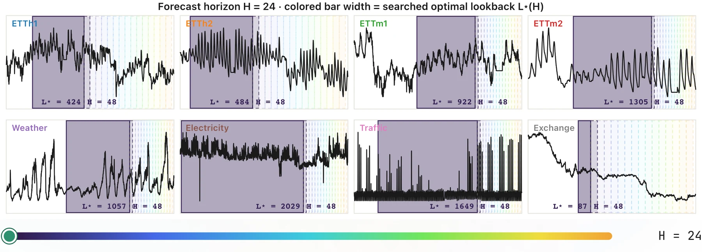

# How Good Can Linear Models Be for Time-Series Forecasting?

<p align="center">
  📄 <a href="https://arxiv.org/abs/2606.27282">Paper (arXiv)</a> &nbsp;|&nbsp;
  🌐 <a href="https://sakanaai.github.io/SearchCast/">Project Page</a> &nbsp;|&nbsp;
  🕹️ <a href="https://sakanaai.github.io/SearchCast/app/">Interactive Demo</a>
</p>

<p align="center">
  
</p>

<p align="center"><em>Optimal forecasting context is heterogeneous and non-monotonic in horizon: as the forecast horizon <code>H</code> sweeps 24&rarr;720, the searched optimal lookback <code>L&#42;(H)</code> grows, plateaus, or shrinks per dataset.</em></p>

Automated hyperparameter search for Ridge regression forecasting using Optuna. Finds optimal combinations of scaling strategies, lookback windows, regularization parameters, and data augmentation for multivariate time series datasets.

## Installation

```bash
pip install -r requirements.txt
```

## Quick Start

### Single Run

```bash
# Run optimization on weather dataset (default)
python optuna_ridge.py

# Specify dataset and output directory
python optuna_ridge.py --input_csv data/ETTh1.csv --output_dir exps/my_experiment

# Faster search with horizon grouping (must divide 96, 192, 336, 720)
python optuna_ridge.py --local_horizon_group_size 48

# Use k-fold cross-validation
python optuna_ridge.py --n_folds 3 --n_trials 20
```

### Reproducing the paper

The paper sweeps `--local_series_group_size` (sgs) over the divisors of each
dataset's series count and selects the value with the lowest mean Local MSE.
The `scripts/reproduce.sh` helper runs this sweep with the canonical
configuration for every shipped dataset:

```bash
scripts/reproduce.sh                 # all datasets
scripts/reproduce.sh etth1 weather   # a subset
```

Each run uses the canonical setting below (sgs is the swept value):

```bash
python optuna_ridge.py \
  --input_csv data/ETTh1.csv \
  --output_dir exps/exp8_etth1_sgs7_pooled \
  --scaler_scope local \
  --scaler_method mean \
  --local_horizon_group_size 24 \
  --local_series_group_size 7 \
  --n_folds 3 \
  --n_trials 20 \
  --pool_series \
  --instance_norm   # only affects the global baseline, not the tuned Ridge model
```

## Command Line Arguments

### Basic Arguments

| Argument | Default | Description |
|----------|---------|-------------|
| `--input_csv` | `data/weather.csv` | Input CSV file path |
| `--output_dir` | `results` | Output directory for results |
| `--local_horizon_group_size` | `24` | Group horizons for HP search (valid: 1,2,3,4,6,8,12,16,24,48) |
| `--local_series_group_size` | `1` | Group series for HP search (1=per-series, -1=all share HPs) |
| `--pool_series` | `False` | When set, pool training windows across all series in each series group and train a single forecast model per group; otherwise, series in the group only share selected hyperparameters, but each series is refit with its own model |
| `--instance_norm` | `False` | Use instance normalization for global baseline |
| `--n_folds` | `1` | Number of folds for expanding window CV |
| `--fold_reg_lambda` | `0.0` | Regularization weight for fold variance |
| `--n_trials` | `30` | Number of Optuna trials per search |

### Ablation Controls

| Argument | Default | Description |
|----------|---------|-------------|
| `--scaler_scope` | `search` | Fix scaler scope: `global`, `local`, or `search` |
| `--scaler_method` | `search` | Fix scaler method: `mean`, `robust`, or `search` |
| `--fixed_local_ratio` | `None` | Fix local_ratio value (disables search) |
| `--fixed_noise_type` | `None` | Fix augmentation: `none`, `time`, `freq`, or `None` (search) |
| `--fixed_aug_sigma` | `None` | Fix augmentation intensity (disables search) |

## Architecture

### Data Pipeline

```
Raw CSV → Sliding Windows (lookback, horizon) → Train/Val/Test Split → Scaling → Optional Augmentation → Ridge Solver
```

### Search Space

| Parameter | Range | Scale |
|-----------|-------|-------|
| `lookback` | 32-2048 | log |
| `local_ratio` | 0.001-1.0 | log |
| `scaler_method` | mean, robust | categorical |
| `noise_type` | none, time, freq | categorical |
| `aug_sigma` | 0.001-0.5 | log |

### Scaling Strategies

- **StandardStrategy**: Mean/std normalization
- **RobustStrategy**: Median/IQR normalization
- **LocalNormScaler**: Per-sample normalization with configurable `last_k` (supports NowNormalization)
- **GlobalScaler**: Dataset-level normalization

### Augmentation

- **TimeDomainNoise**: Gaussian noise with random per-sample intensity
- **FreqDomainNoise**: FFT-based amplitude/phase perturbation

### Solver

Closed-form Ridge regression via normal equations with batched alpha search and Cholesky decomposition.

## Output Files

After running, the output directory contains:

| File | Description |
|------|-------------|
| `local_results.csv` | Per-series/horizon best hyperparameters and metrics |
| `benchmark_comparison.csv` | Local vs global MSE/MAE at cutoffs 96, 192, 336, 720 |
| `predictions.npy` | Raw predictions for visualization |
| `forecast_comparison_*.png` | Visualization plots |

## Supported Datasets

Place datasets in `data/` directory:

- **ETT**: `ETTh1.csv`, `ETTh2.csv`, `ETTm1.csv`, `ETTm2.csv`
- **Others**: `weather.csv`, `exchange_rate.csv`

ETT datasets use fixed 12/4/4 month train/val/test splits. Other datasets use 70/10/20 splits.

## Citation

If you find this work useful, please cite:

```bibtex
@article{huang2026linear,
  title   = {How Good Can Linear Models Be for Time-Series Forecasting?},
  author  = {Huang, Lang and Xu, Jinglue and Darlow, Luke},
  journal = {arXiv preprint arXiv:2606.27282},
  year    = {2026}
}
```
